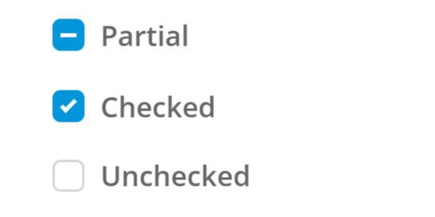
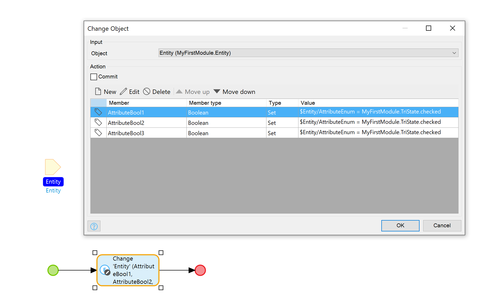
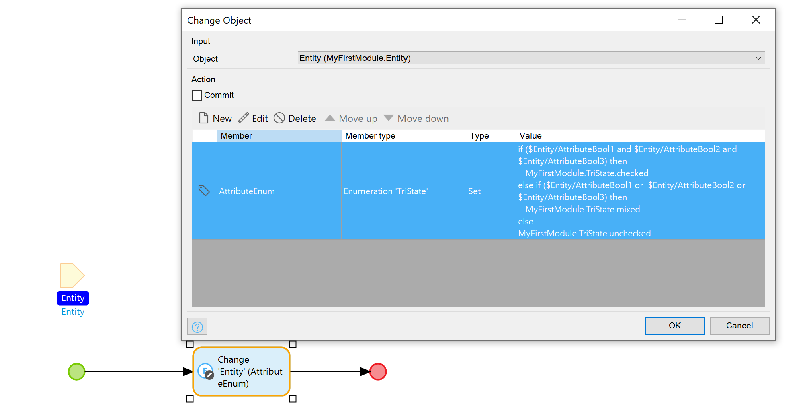
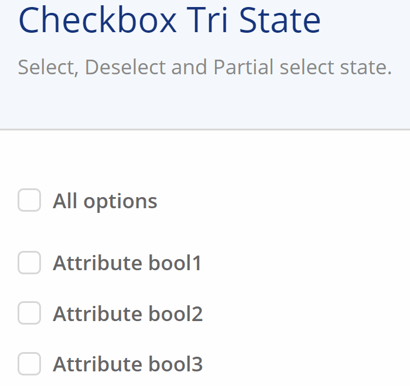

## Checkbox Tri State

Checkbox with three states; checked, unchecked and mixed.



## Features

An easy way to select and deselect a set of boolean attributes. And allowing you to indicated when only some of the underling attributes are selected.

-   CSS styled checkbox, matching the standard checkbox.
-   Intermediated or mixed state, to indicated partial selected options.
-   Click on mixed state checkbox will change the value to checked.
-   Use enumeration attribute as data source.
-   Accessible with key navigation and screen readers.
-   Click on label will update checkbox
-   Overwrite the read only state, and handle changes in a action
-   Label before and/or label after checkbox

Please note:

-   The change of the checkbox does only effect the enumeration attribute and does not automatically reflect to its dependents, it requires an `On change` action.

When Mendix 8.xx has support for editable data source we can add more flexibility to this widget.

## Usage

-   Place the widget in a context, for example a data view or a list view
-   Create a enumeration attribute, to identify the three states; `checked`, `unchecked`, `mixed`
-   In the `Checkbox Tri State` widget;
    -   Select the enumeration attribute, the enumeration should have values with the name:
        -   For checked; "checked", "\_true" or "true".
        -   For unchecked; "unchecked", "\_false" or "false".
        -   For mixed; "mixed", "partial", "some" or "indeterminate".
    -   Add an `On change` event nanoflow to update the state of the correlated boolean attributes. Set they value to `$Entity/AttributeEnum = MyFirstModule.TriState.checked` for each related boolean
        
-   In the correlated boolean widgets, add an `On change` event nanoflow to update the `Checkbox Three State` widgets enumeration attribute.
    ```python
    if ($Entity/AttributeBool1 and $Entity/AttributeBool2 and $Entity/AttributeBool3) then
        MyFirstModule.TriState.checked
    else if ($Entity/AttributeBool1 or  $Entity/AttributeBool2 or $Entity/AttributeBool3) then
        MyFirstModule.TriState.mixed
    else
        MyFirstModule.TriState.unchecked
    ```
    

### Overwrite editability

An additional use case; Use this widget for editing an attribute inside a non editable List View with the `Overwrite` option. This way you can still have the **Load more** functionality, and not all items are loaded in the list. In that case you have use the `On change overwrite` action to handle the state change.

## Demo


